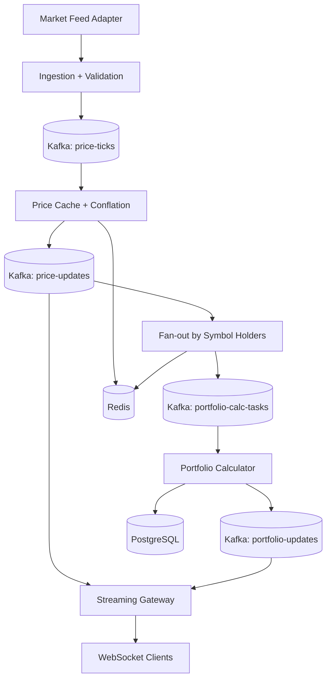
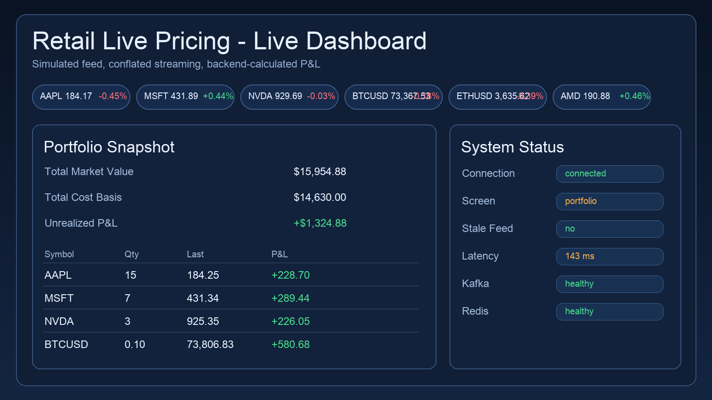
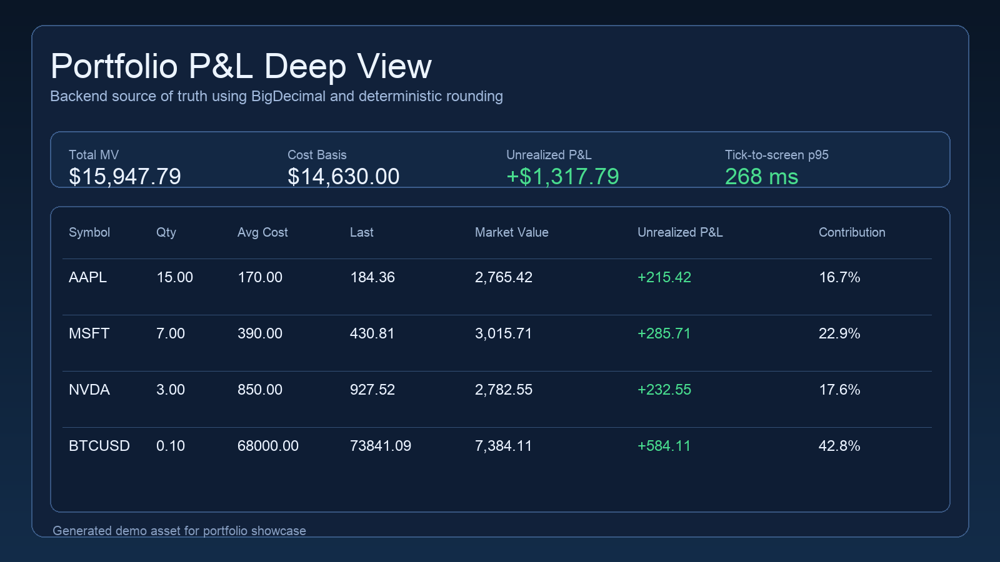
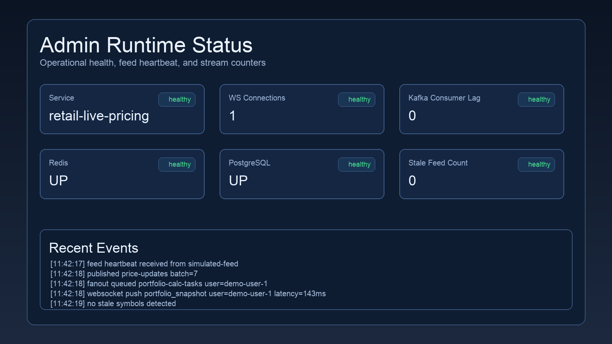
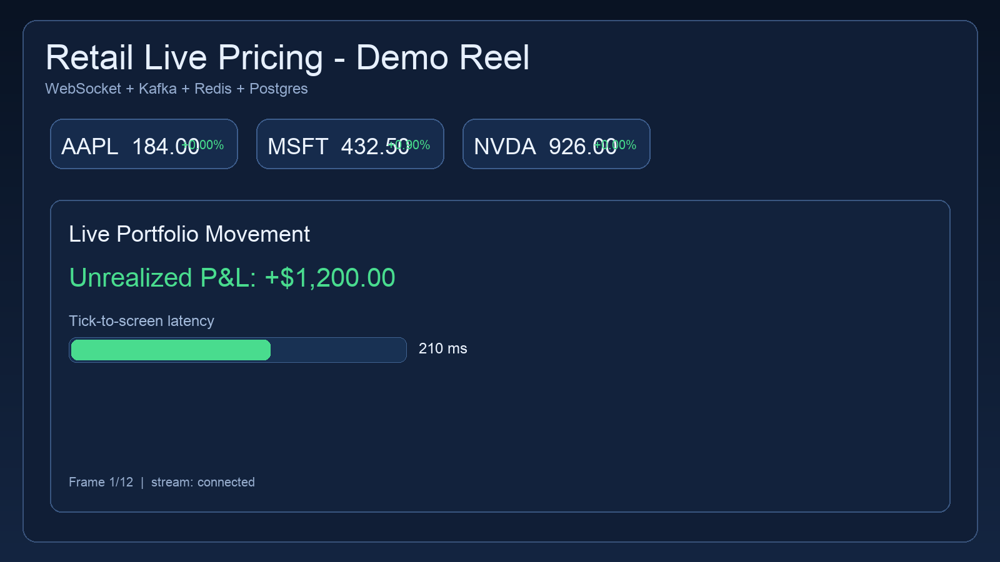

# Retail Live Pricing

Production-oriented **live pricing + portfolio P&L streaming** system for a Robinhood-style retail trading experience.

This repository demonstrates a **modular monolith v1** that can be split into microservices at clear scale thresholds.

## Table of Contents

- [Why This Project](#why-this-project)
- [Current Status](#current-status)
- [Architecture](#architecture)
- [Architecture Decisions (Recruiter-Friendly)](#architecture-decisions-recruiter-friendly)
- [Module Breakdown](#module-breakdown)
- [Event Contracts](#event-contracts)
- [WebSocket Protocol](#websocket-protocol)
- [REST API Quick Reference](#rest-api-quick-reference)
- [Data Model](#data-model)
- [Redis Key Model](#redis-key-model)
- [Local Development](#local-development)
- [Demo Script (For Portfolio Videos)](#demo-script-for-portfolio-videos)
- [Screenshots and Demo GIF](#screenshots-and-demo-gif)
- [Configuration Profiles](#configuration-profiles)
- [Quality and Testing](#quality-and-testing)
- [Observability](#observability)
- [Performance and SLO Targets](#performance-and-slo-targets)
- [CI/CD](#cicd)
- [AWS Deployment Skeleton](#aws-deployment-skeleton)
- [Security Notes](#security-notes)
- [Portfolio Talking Points](#portfolio-talking-points)
- [Roadmap](#roadmap)
- [Publication Checklist](#publication-checklist)
- [Documentation](#documentation)
- [License](#license)

## Why This Project

Retail users expect:
- fast price updates
- consistent portfolio valuation
- smooth real-time UX on weak mobile networks

This system is built around those constraints with:
- backend-owned P&L (`BigDecimal` deterministic math)
- event-driven pipeline with Kafka
- screen-based WebSocket subscriptions
- conflation/throttling for bandwidth and stability

## Current Status

Implemented v1 foundation:
- modular architecture (`ingestion`, `pricingcache`, `fanout`, `portfolio`, `streaming`, `security`, `admin`)
- simulated market feed with pluggable adapter interface
- Kafka topics and event contracts
- Redis-backed symbol-holder and session indexing
- PostgreSQL + Flyway schema
- live WebSocket dashboard demo
- CI workflow + Docker local stack + Terraform AWS skeleton

## Architecture



## Architecture Decisions (Recruiter-Friendly)

| Problem | Chosen Approach | Rejected Alternative | Why It Matters |
|---|---|---|---|
| Real-time client connection model | One WebSocket per user | One connection per symbol | Prevents connection explosion and simplifies lifecycle handling |
| Subscription semantics | Screen-based context protocol | Direct per-symbol client subscriptions | Keeps backend in control of authorization, routing, and fan-out |
| Event backbone | Kafka topics | In-memory / fire-and-forget pub-sub | Enables replay, retention, independent consumer groups |
| P&L ownership | Backend computes all P&L | Client-side portfolio math | Guarantees deterministic values and auditable history |
| Burst handling | Tiered conflation windows | Push every single tick | Preserves UX while controlling downstream load |
| Portfolio recalc trigger | Event-driven task fan-out | Timer-only full recomputation | Scales better with active symbol/user intersections |

## Module Breakdown

- `ingestion`: receives ticks from adapter, validates sequence/outliers, publishes `TickV1`
- `pricingcache`: hot in-memory + Redis cache, conflates updates, publishes `PriceUpdateV1`
- `fanout`: resolves impacted users via `holders:{symbol}`, emits `PortfolioCalcTaskV1`
- `portfolio`: calculates portfolio snapshot + persists audit events
- `streaming`: WebSocket session management, screen context, outbound push
- `admin`: health/config/replay-control stubs
- `security`: JWT filter scaffold + route authorization

## Event Contracts

Kafka topics:
- `price-ticks`
- `price-updates`
- `portfolio-calc-tasks`
- `portfolio-updates`
- `pricing-dead-letter`

Primary records:
- `TickV1`
- `PriceUpdateV1`
- `PortfolioCalcTaskV1`
- `PortfolioSnapshotV1`

## WebSocket Protocol

Endpoint:
- `ws://localhost:8080/ws/pricing?userId=demo-user-1`

Inbound messages:
```json
{"type":"screen_context","screen":"PORTFOLIO","symbols":["AAPL","MSFT"]}
{"type":"app_state","state":"BACKGROUND"}
{"type":"heartbeat"}
```

Outbound messages:
```json
{"type":"price_batch","serverTime":"...","updates":[...]}
{"type":"portfolio_snapshot","serverTime":"...","snapshot":{...}}
{"type":"system_status","serverTime":"...","status":"ok","detail":"..."}
```

## REST API Quick Reference

| Endpoint | Method | Purpose |
|---|---|---|
| `/actuator/health` | GET | Service health |
| `/actuator/prometheus` | GET | Metrics scraping |
| `/api/admin/status` | GET | Runtime status summary |
| `/api/admin/feeds/health` | GET | Feed heartbeat snapshot |
| `/api/admin/symbol-config` | POST | Symbol config stub |
| `/api/admin/replay` | POST | Replay control stub |
| `/api/portfolio/demo-user-1` | GET | Current computed portfolio snapshot |

## Data Model

Flyway migration creates:
- `users`
- `portfolios`
- `positions`
- `position_lots`
- `watchlists`
- `audit_events`

## Redis Key Model

- `price:{symbol}` latest price
- `holders:{symbol}` set of user IDs holding symbol
- `session:{userId}` latest session context marker

## Local Development

### Prerequisites
- Java 21
- Docker + Docker Compose

### Option A: Start Infra From This Repo Compose
```bash
docker compose up -d postgres redis kafka kafka-ui
```

### Option B: Use Your Existing Standalone Local Dependencies

If you already run shared local services (your current setup), ensure:
- PostgreSQL on `localhost:5432` with database `live_pricing`
- Redis on `localhost:6379` with password `SeCrET`
- Kafka broker on `localhost:9092`
- Kafka UI on `localhost:5777` (optional but recommended)

### Run App Locally
```bash
./gradlew bootRun
```

### Open Demo UI
- http://localhost:8080/index.html

The demo seeds `demo-user-1` with a sample portfolio and streams simulated market updates.

### E2E Smoke Test (Recommended)

1. Health:
```bash
curl http://localhost:8080/actuator/health
```

2. Admin status:
```bash
curl http://localhost:8080/api/admin/status
```

3. Feed heartbeat:
```bash
curl http://localhost:8080/api/admin/feeds/health
```

4. Portfolio snapshot (requires auth header in current scaffold):
```bash
curl -H "Authorization: Bearer demo-token" \
  http://localhost:8080/api/portfolio/demo-user-1
```

5. WebSocket stream:
- open `http://localhost:8080/index.html`
- or connect manually to:
  - `ws://localhost:8080/ws/pricing?userId=demo-user-1`

6. Kafka verification in UI:
- open `http://localhost:5777`
- validate topics are receiving records:
  - `price-ticks`
  - `price-updates`
  - `portfolio-calc-tasks`
  - `portfolio-updates`

### Stop App
Press `Ctrl+C` where `bootRun` is running.

### Useful Commands

Run tests:
```bash
./gradlew test
```

Build artifact:
```bash
./gradlew bootJar
```

Run with helper script:
```bash
./scripts/run-local.sh
```

### Redis Credentials Injection

Application Redis connection reads these Spring env vars:
- `SPRING_DATA_REDIS_HOST`
- `SPRING_DATA_REDIS_PORT`
- `SPRING_DATA_REDIS_PASSWORD`

If you prefer your local naming convention, export and map before running:
```bash
export CACHE_REDIS_HOST=localhost
export CACHE_REDIS_PORT=6379
export CACHE_REDIS_PASS=SeCrET

export SPRING_DATA_REDIS_HOST="$CACHE_REDIS_HOST"
export SPRING_DATA_REDIS_PORT="$CACHE_REDIS_PORT"
export SPRING_DATA_REDIS_PASSWORD="$CACHE_REDIS_PASS"
```

### Kafka UI Connection Note

If Kafka UI logs show `Connection to node 1 (localhost:9092) could not be established`:
- ensure Kafka container advertises `localhost:9092` for host clients
- ensure Kafka UI is configured to use `localhost:9092` (not `kafka:9092`) when both run on your host network context
- verify broker is up:
```bash
docker ps | grep kafka
```

## Demo Script (For Portfolio Videos)

Use this script while recording a 60-90 second demo:
1. Start infra and app (`docker compose ...`, `./gradlew bootRun`).
2. Open `/index.html` and show live symbol tape movement.
3. Show portfolio totals and per-line P&L moving in real time.
4. Show latency badge and explain tick-to-screen target.
5. Call `/api/admin/status` to show active runtime metrics.
6. Highlight architecture diagram + ADRs in repo.

## Screenshots and Demo GIF

Add these files to improve portfolio impact:
- `docs/assets/dashboard-live.png`
- `docs/assets/portfolio-pnl.png`
- `docs/assets/admin-status.png`
- `docs/assets/live-pricing-demo.gif`

Then embed them like this:

```md




```

## Configuration Profiles

- `application.yaml`: shared defaults
- `application-local.yaml`
- `application-staging.yaml`
- `application-prod.yaml`

Key knobs:
- ingestion interval
- tier conflation windows
- outlier thresholds by asset class
- Kafka topic names

## Quality and Testing

Current automated tests cover:
- deterministic P&L arithmetic (`PortfolioMathTests`)
- tier conflation window policy
- outlier tick validation
- smoke test

## Observability

- Spring Actuator metrics endpoint enabled (`/actuator/prometheus`)
- Prometheus scrape + alert rules included:
  - `/Users/mohamedali/Projects/personal/java/retail-live-pricing/ops/prometheus.yml`
  - `/Users/mohamedali/Projects/personal/java/retail-live-pricing/ops/prometheus-alerts.yml`
- Grafana dashboards provisioned for:
  - business overview
  - latency and SLOs
  - pipeline health (including Kafka consumer lag panels)
- Alertmanager routing config included:
  - `/Users/mohamedali/Projects/personal/java/retail-live-pricing/ops/alertmanager.yml`
- Runbooks linked directly from alert annotations:
  - `/Users/mohamedali/Projects/personal/java/retail-live-pricing/docs/runbooks/alerts.md`
- Structured logging + correlation:
  - JSON logs configured in `/Users/mohamedali/Projects/personal/java/retail-live-pricing/src/main/resources/logback-spring.xml`
  - HTTP `X-Correlation-Id` filter and propagation to Kafka headers/consumers
  - WS logs include `userId` and `wsSessionId` fields when available

## Performance and SLO Targets

Target operational goals:
- tick-to-screen p95 < 500ms
- portfolio calc lag alert at > 5s
- stale-feed detection with configurable threshold

## CI/CD

GitHub Actions workflow (`.github/workflows/ci.yml`) currently runs:
- checkout
- Java setup + cache
- `./gradlew clean test bootJar`

Recommended next CI steps:
- integration test stage with Testcontainers-backed Kafka/Postgres
- image scan stage
- staging deploy + smoke check

## AWS Deployment Skeleton

Terraform starter in `terraform/aws/` provisions foundational pieces:
- VPC/subnets
- RDS PostgreSQL
- ElastiCache Redis

Planned extension:
- MSK
- ECS/EKS + ALB
- CloudWatch dashboards/alarms

## Security Notes

- JWT filter exists as a scaffold (header parsing + auth context)
- Replace with full signature validation/JWKS in production
- tighten route authorization and role mapping before public deployment
- add secret manager integration for database and broker credentials

## Portfolio Talking Points

If showcasing this in interviews/portfolio, highlight:
- how symbol→user fan-out is handled
- why backend P&L is non-negotiable in fintech contexts
- how conflation controls latency-vs-bandwidth tradeoff
- migration path from modular monolith to microservices

## Roadmap

1. Add real vendor adapter integration behind `MarketDataAdapter`
2. Implement robust JWT verification + key rotation
3. Add per-user tier policy persisted in DB
4. Add consumer retry/DLQ handlers and replay workflows
5. Introduce load test harness and publish benchmark report
6. Split `streaming` service first once connection count grows

## Publication Checklist

Before publishing this as a portfolio project:
- add screenshots and one demo GIF to `docs/assets/`
- add project board or milestones to show execution plan
- add license (`MIT` or `Apache-2.0`)
- add architecture thumbnail at top of README
- add benchmark numbers from load test run
- add one short case-study section: "trade-offs and what I'd improve with 3 more weeks"

## Documentation

- Architecture: `docs/architecture.md`
- ADR-0001 Kafka decision
- ADR-0002 Screen-based subscriptions
- ADR-0003 Backend-owned P&L

## License

Add your preferred license before publishing publicly (`MIT`/`Apache-2.0` are common portfolio choices).
