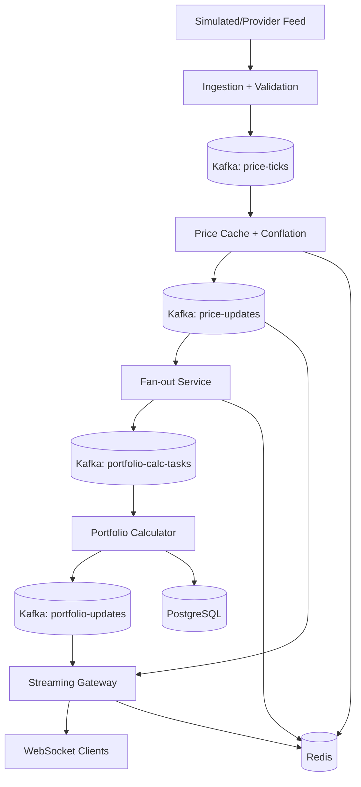

# Architecture Overview

```mermaid
flowchart TD
    A[Simulated/Provider Feed] --> B[Ingestion + Validation]
    B --> C[(Kafka: price-ticks)]
    C --> D[Price Cache + Conflation]
    D --> E[(Kafka: price-updates)]
    E --> F[Fan-out Service]
    F --> G[(Kafka: portfolio-calc-tasks)]
    G --> H[Portfolio Calculator]
    H --> I[(Kafka: portfolio-updates)]
    E --> J[Streaming Gateway]
    I --> J
    J --> K[WebSocket Clients]
    H --> L[(PostgreSQL)]
    D --> M[(Redis)]
    F --> M
    J --> M
```

## SLOs
- Tick-to-screen p95 under 500ms
- Portfolio calc lag alert at 5s
- Stale feed detection threshold configurable per asset class
